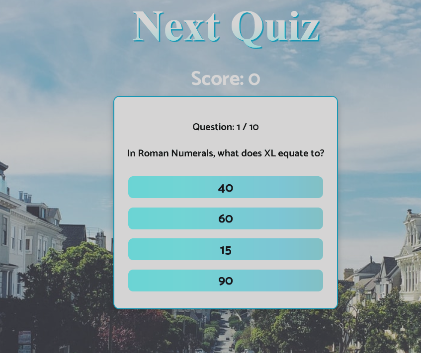

# Quiz App

A Quiz app where user can answer 10 random questions and judge himself/herself based on score out of 10 where each question is of 1 point


## API Reference

#### Get the questions on based of amount, type and difficulty level

```http
  GET https://opentdb.com/api.php?amount=${amount}&difficulty=${difficulty}&type=multiple
```

| Parameter | Type     |
| :-------- | :------- |
| `amount` | `number`|
| `difficulty` | `string`|
| `type` | `multiple or string`|

## Authors

- [@jainChetan](https://thechetanjain.in)

## Color Reference

| Color             | Hex                                                                |
| ----------------- | ------------------------------------------------------------------ |
| Background Color|  #000000 |
| Text Color |  #ffffff|


## Install

To install this project with npm or yarn.
Go to project directory


```bash
  git clone https://github.com/jainChetan81/TypeScript-Next-PWA.git
  cd TypeScript-Next-PWA
```

then

```bash
  npm install || yarn install
  npm run dev || yarn dev
```


## Build

To build this project with npm or yarn.
Go to project directory

```bash
  npm run build || yarn build
```
To build this project with static pages without edge functions where Server Side Rendering won't work
```bash
  npm run build && npm run export || yarn dev && yarn export
```

## Tech Stack

**Client:** React, Context API , next-pwa, styled-components, typescript

**Context API**- for State managment\
**next-pwa** - for generating service worker\
**styled-components** - for writing css in javascript\
**typescript** - type based language developed on top of javscript\

## Project Structure
    --- ## api
    --- ## public
    --- ## component
    --- ## styles
    --- ## pages
    --- ## types
    --- ## utils

## Lessons Learned

- I started this project to learn about Nextjs and its working with typescript
- Nextjs is used for for serverside fetching of the quiz api so that page is generated in the server not on client side and yet everytime questions will be different.

## Contributing

Contributions are always welcome!

See project structure

Please adhere to the Project Structure


## Feedback

If you have any feedback, please reach out to me at jain.cj.chetan@gmail.com


## 🚀 About Me
I am a Full Stack Web Developer with over two years of experience in various tech stacks.


## 🔗 Links
[](https://thechetanjain.in/)
[](https://thechetanjain.in/linkedin/)
[](https://thechetanjain.in/github)


## Screenshots


## Running Tests

To run tests with unit testing and end to end testing and finally a report, run the following command

```bash
  npm run test:jest
  npm run test:cypress
  test:mocha-report
```

